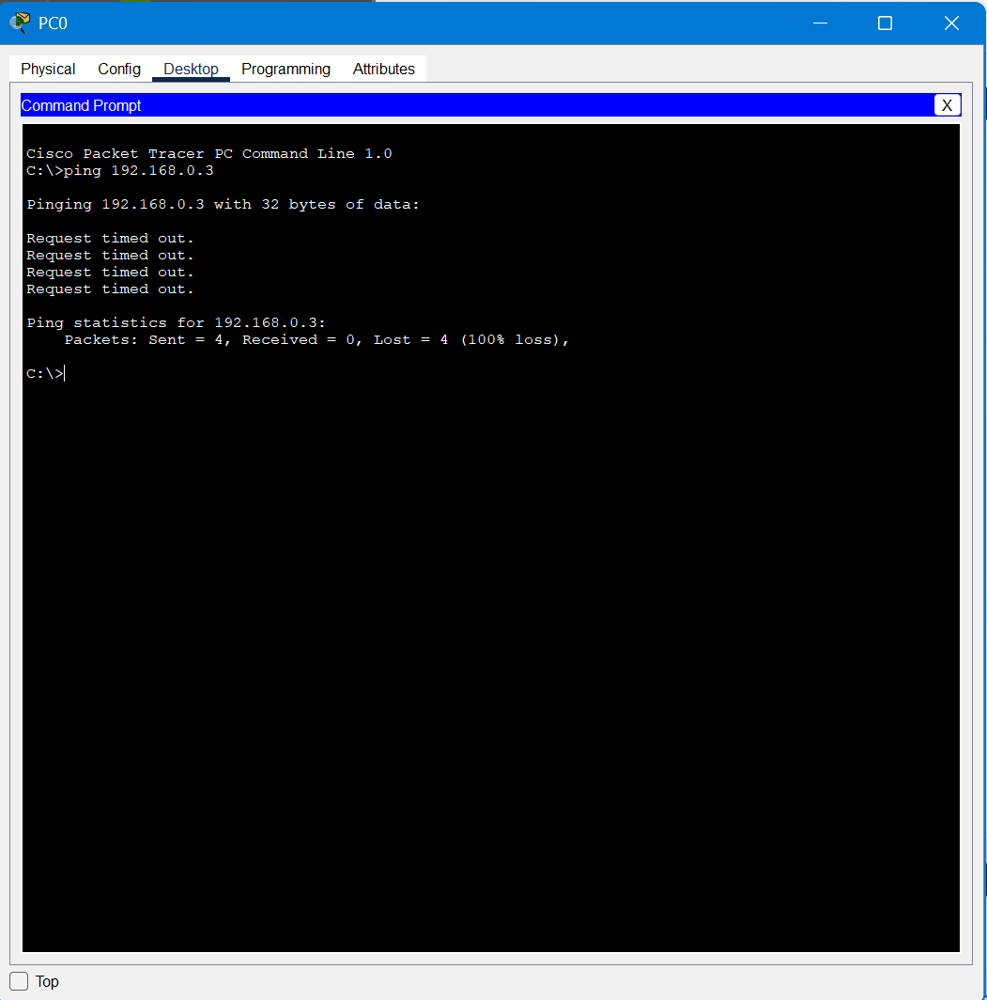
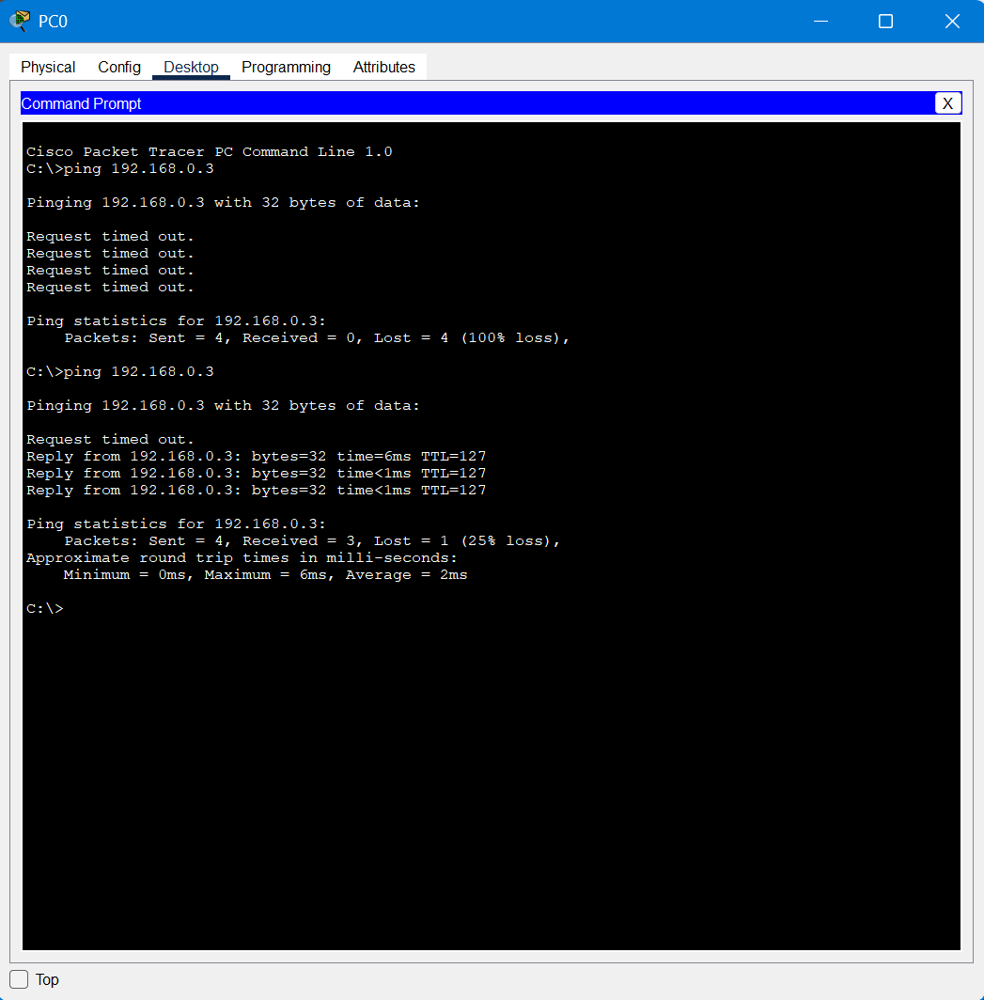
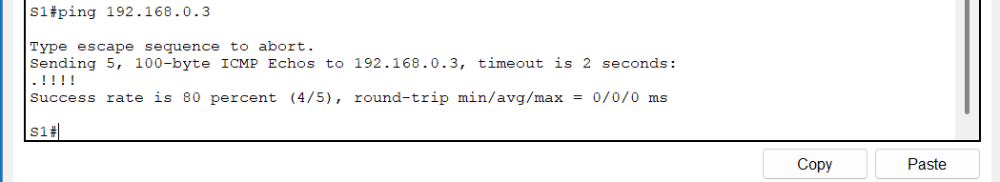

# Tugas Akhir Judul 2 **Praktikum Jaringan Komputer**

# 🧩 Build a Switch and Router Network

Proyek ini berisi latihan konfigurasi jaringan dasar menggunakan router dan switch untuk membangun konektivitas antar perangkat.  
Contoh hasil pengujian konektivitas jaringan ditunjukkan di bawah ini:

### 🔻 Ping Gagal

Masalah utama adalah konfigurasi Layer 3 (Network Layer) yang belum selesai, yaitu :

Tujuan Ping (192.168.0.3) di Subnet Lain: PC0 sadar bahwa tujuan berada di luar jaringannya, sehingga paket harus dikirim ke Default Gateway (interface router).

Router Belum Siap: Karena interface router (default gateways) belum dikonfigurasi, router tidak memiliki alamat IP yang valid atau tidak tahu cara merutekan lalu lintas.

Layer 3 Gagal: Tanpa konfigurasi default gateway yang benar, paket dari PC0 akan gagal mencapai router atau gagal dirutekan oleh router ke subnet tujuan. Ini menyebabkan paket ICMP "timeout" dan menghasilkan 100% loss.

---

### ✅ Ping Berhasil

Ping berhasil (3 paket diterima) karena router kini sudah dikonfigurasi dengan benar (Layer 3), sehingga lalu lintas bisa dirutekan melintasi dua subnet.

---

### ✅ Ping Berhasil

Ping berhasil dari S1 ke PC-B karena router telah dikonfigurasi dengan benar untuk merutekan lalu lintas Layer 3 antar subnet, dan Switch S1 memiliki Default Gateway yang dikonfigurasi untuk mengirim paket ke luar jaringannya.

---

## ⚙️ Fungsi Perintah Penting

### 🔹 Mode dan Akses
- `enable` → Masuk ke mode privileged untuk menjalankan perintah tingkat lanjut.  
- `configure terminal` → Masuk ke mode konfigurasi global.  
- `hostname` → Mengubah nama perangkat agar mudah dikenali.  
- `no ip domain-lookup` → Mencegah perangkat menerjemahkan salah ketik sebagai nama domain.  

### 🔹 Keamanan Akses
- `enable secret` → Menetapkan password terenkripsi untuk mode privileged.  
- `line console 0` → Mengatur akses lewat console (langsung ke perangkat).  
- `line vty 0 4` → Mengatur akses jarak jauh (Telnet/SSH).  
- `password` dan `login` → Mengatur kata sandi dan mewajibkan login.  
- `service password-encryption` → Mengenkripsi semua password dalam konfigurasi.  
- `banner motd` → Menampilkan pesan peringatan saat seseorang mengakses perangkat.  

### 🔹 Konfigurasi Interface
- `interface` → Masuk ke pengaturan antarmuka jaringan.  
- `description` → Menambahkan keterangan koneksi untuk dokumentasi.  
- `no shutdown` → Mengaktifkan interface (karena default-nya dalam keadaan nonaktif).  

### 🔹 Routing dan Jaringan
- `ipv6 unicast-routing` → Mengaktifkan fungsi routing untuk alamat IPv6.  
- `ip default-gateway` → Menentukan jalur keluar bagi perangkat non-routing seperti switch.  

### 🔹 Manajemen Konfigurasi
- `copy running-config startup-config` → Menyimpan konfigurasi agar tetap ada setelah perangkat di-restart.  
- `show ip interface brief` → Menampilkan status singkat semua interface.  
- `show ipv6 interface brief` → Menampilkan status antarmuka IPv6.  

---

## 🔍 Tujuan Utama
1. Mengonfigurasi perangkat jaringan (router & switch) dari kondisi awal.  
2. Mengamankan akses dengan password dan enkripsi.  
3. Mengaktifkan interface agar komunikasi antar perangkat berjalan.  
4. Memverifikasi koneksi dan memastikan routing bekerja dengan benar.  

---

## Link YouTube : [Klik di sini](https://youtu.be/EJFljABo2s8)

---

## 📘 Catatan
README ini merangkum fungsi utama perintah konfigurasi jaringan pada lab *Build a Switch and Router Network* tanpa mencantumkan alamat IP atau detail konfigurasi teknis.